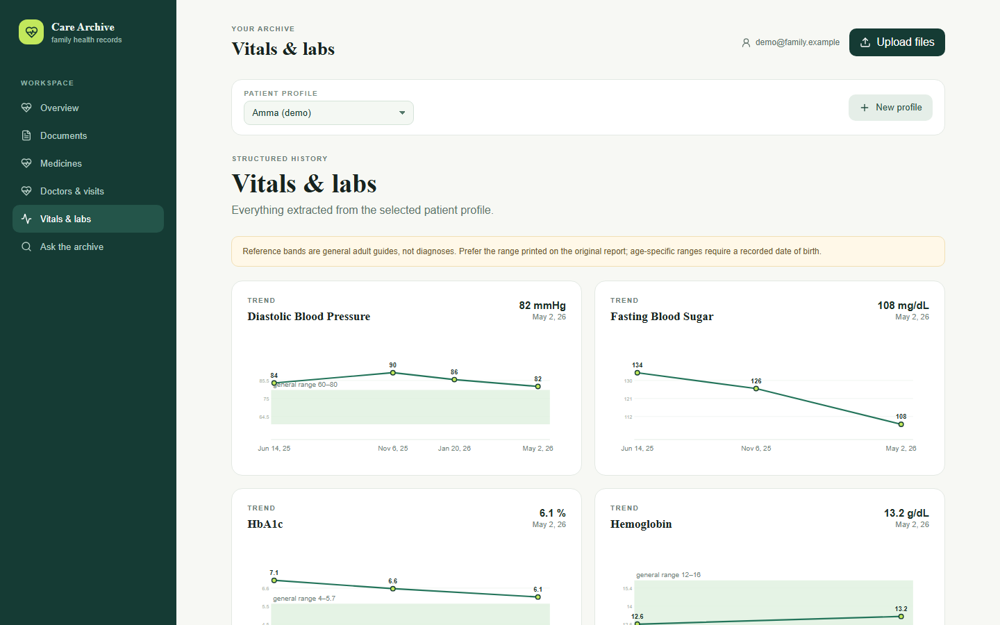
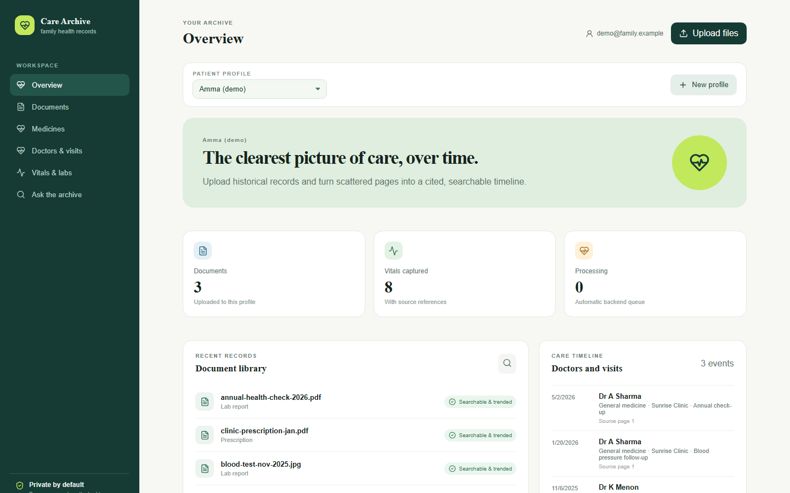

# Care Archive

**Self-hosted, private medical-record archive for families.** Upload prescriptions, lab reports, and scans; an AI pipeline extracts medicines, vitals, lab values, and doctor visits into a searchable, cited timeline — running entirely on *your own* Supabase project and Gemini API key.

[](LICENSE)
[](https://github.com/sriraam-balaji/medical-history-rag/actions/workflows/ci.yml)

> ⚠️ **Not medical advice.** Care Archive is an organizational tool for your own records. Extractions can contain errors — always verify against the original document, and consult a qualified clinician for medical decisions.



<details>
<summary>More screenshots</summary>



</details>

*Screenshots show demo data, not real records.*

---

## Why

Medical history for a family ends up scattered across paper prescriptions, WhatsApp photos, and lab PDFs. SaaS health apps want you to upload all of it to *their* servers. Care Archive is the self-hosted alternative: you control the database, the storage bucket, and the API keys. Clone it, plug in your own free-tier Supabase project and Gemini key, and it's yours.

## Features

- **Multi-profile family workspace** — isolated records per family member, enforced with Postgres Row Level Security.
- **AI extraction pipeline** — handwritten prescriptions, lab reports, and consultation notes parsed into structured medicines, vitals, labs, and visit events (Gemini multimodal), with page-level provenance on every fact.
- **Lab & vital trend charts** — repeated measurements plotted over a time-proportional axis against general adult reference ranges.
- **Cited archive search (RAG)** — ask natural-language questions across a patient's records; answers cite source documents and pages (768-dim Gemini embeddings + pgvector).
- **Auditability** — raw JSON extractions stored with prompt/schema versioning; idempotent re-extraction per document.

## Tech Stack

| Layer | Tech |
|---|---|
| Frontend | Vite, React 19, TypeScript, plain CSS |
| Backend | Supabase (Postgres + RLS, Auth, Storage, Deno Edge Functions) |
| AI | Google Gemini (multimodal extraction + embeddings), pgvector |
| Hosting | Any static host (Cloudflare Pages config included) |

## Setup (~15 minutes)

### 1. Supabase project

1. Create a project at [supabase.com](https://supabase.com) (free tier works).
2. In the SQL Editor, run each file in [`supabase/migrations/`](supabase/migrations/) in filename order.
3. Create a **private** Storage bucket named `medical-documents`.
4. In Authentication → Providers → Email, disable "Confirm email" (or keep it and confirm accounts manually).

### 2. Edge functions

```bash
npm install
npx supabase login
npx supabase functions deploy enqueue-gemini-batch --project-ref YOUR_PROJECT_REF --no-verify-jwt
npx supabase functions deploy ask-archive --project-ref YOUR_PROJECT_REF
npx supabase secrets set GEMINI_API_KEY=your-gemini-key --project-ref YOUR_PROJECT_REF
```

Get a free Gemini API key at [aistudio.google.com](https://aistudio.google.com/apikey). `SUPABASE_URL`, `SUPABASE_ANON_KEY`, and `SUPABASE_SERVICE_ROLE_KEY` are injected into edge functions automatically.

### 3. Frontend

```bash
cp .env.example .env.local   # fill in VITE_SUPABASE_URL and VITE_SUPABASE_PUBLISHABLE_KEY
npm run dev
```

### 4. Deploy (optional)

Any static host works. For Cloudflare Pages: build command `npm run build`, output directory `dist`, and set the two `VITE_*` environment variables in the Pages project settings. The SPA rewrite rule ships in `public/_redirects`.

## How it works

```
Upload (PDF/photo) ──► Supabase Storage ──► enqueue-gemini-batch (edge fn)
                                              │  Gemini multimodal extraction
                                              ▼
                     medicines / vitals / lab_results / medical_events tables
                                              │  + chunked JSON → embeddings → pgvector
                                              ▼
                     ask-archive (edge fn) ◄── natural-language question
                     answers grounded in retrieved chunks, with citations
```

## Contributing

PRs welcome! See [CONTRIBUTING.md](CONTRIBUTING.md). Good first areas: more lab reference ranges, i18n, additional document-date formats, dark mode.

## License

[MIT](LICENSE)
